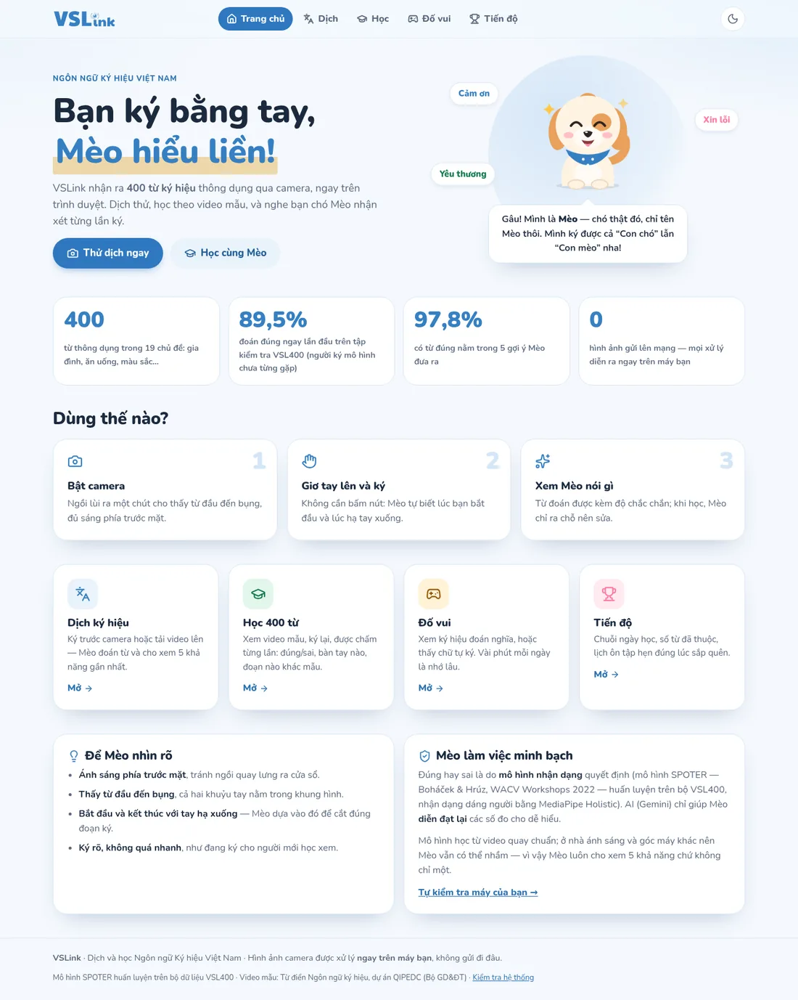
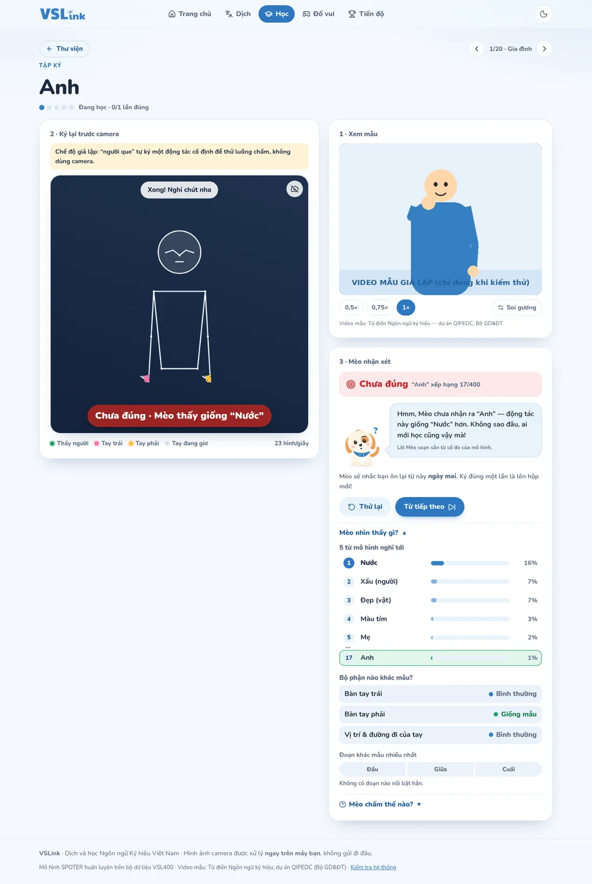
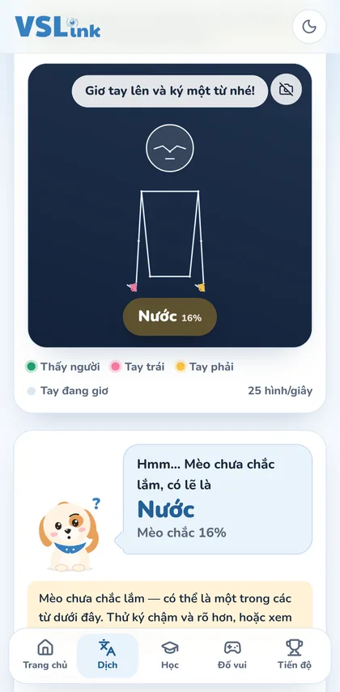

# VSLink v2 — Dịch và học Ngôn ngữ Ký hiệu Việt Nam cùng Mèo

Web nhận dạng **400 từ** Ngôn ngữ Ký hiệu Việt Nam qua camera, chạy **hoàn toàn trên trình duyệt** (không cần máy chủ, hình ảnh không rời khỏi máy người dùng). Có bạn chó **Mèo** (vâng, chó tên Mèo) làm trợ giảng: nhận xét từng lần ký, bằng AI (Gemini) nếu có cấu hình, hoặc bằng lời soạn sẵn.

<p align="center">
  
</p>

| Tập ký một từ | Dịch trên điện thoại |
| --- | --- |
|  |  |

> Ảnh chụp ở **chế độ giả lập** (`?gia-lap=1`): một "người que" tự ký thay cho camera, video mẫu là video giả vì máy chụp ảnh không vào được QIPEDC. Web thật dùng camera và video của Từ điển Ngôn ngữ ký hiệu QIPEDC.

## Tính năng

| Mục | Làm được gì |
| --- | --- |
| **Dịch** | Ký trước camera — web **tự biết lúc bắt đầu và kết thúc** (giơ tay lên → ký → hạ tay), không cần bấm nút. Hiện từ đoán ngay trên khung camera, 5 khả năng kèm %, cảnh báo "chưa chắc" khi xác suất thấp, lý do khi không chấm (ký quá ngắn, gần như đứng yên…). Có thể **tải video lên** (kể cả video quay kiểu soi gương). |
| **Ghép câu** (thử nghiệm) | Chọn thẻ *Ghép câu* trên trang Dịch, ký từng từ (hạ tay giữa các từ): Mèo gom top-3 của mỗi từ rồi nhờ Gemini (qua Worker) **chọn từ hợp ngữ cảnh và đổi trật tự ký hiệu (Chủ – Tân – Động) sang câu tiếng Việt**. Câu hiện ngay trên khung camera; bấm vào một từ để đổi sang từ khác Mèo nghĩ tới. Không có Worker thì nối từ theo thứ tự ký. Nghiên cứu, dữ liệu và notebook: [`nghien-cuu/ghep-cau/`](nghien-cuu/ghep-cau/README.md). |
| **Học** | Thư viện 400 từ, 19 chủ đề, tìm **không dấu**. Mỗi từ: video mẫu (chỉnh tốc độ 0,5×/0,75×, bật soi gương) + camera. Mỗi lần ký được chấm **Đúng / Gần đúng / Chưa đúng**, chỉ ra **bàn tay nào, đoạn nào khác mẫu**, rồi Mèo nhận xét. |
| **Đố vui** | *Xem ký hiệu — đoán nghĩa* (4 đáp án cùng chủ đề) và *Thấy chữ — tự ký* (mô hình chấm). |
| **Tiến độ** | Chuỗi ngày học, số từ đã thuộc, lịch 4 tuần, **ôn tập giãn cách** (hộp Leitner: hẹn ôn sau 1, 2, 4, 7, 15 ngày), tiến độ theo chủ đề. Lưu trên trình duyệt, không cần tài khoản. |
| **Về dự án** (`/gioi-thieu/`) | Nhóm thực hiện, cách VSLink hoạt động, minh bạch và riêng tư, độ chính xác, giới hạn, nguồn tham khảo. |
| **Góp ý** (`/gop-y/`) | Người dùng báo Mèo đoán sai / câu chưa đúng / lỗi web / đề xuất. Từ trang Dịch có nút *Báo cho nhóm* đính kèm sẵn kết quả vừa rồi. Góp ý về **Google Sheet của nhóm** (xem mục 3b). Có thêm phần *Gặp sự cố?* và *Tự kiểm tra camera*. |
| **Kiểm tra hệ thống** (`/kiem-tra/`, **chỉ cho nhóm**) | So kết quả mô hình trên trình duyệt với Python, thử camera + MediaPipe, thử Mèo AI và chẩn đoán Worker. Trang này và `/cong-cu/` **không có trên web công khai**: chỉ mở được khi chạy `npm run dev`, hoặc build với `VITE_CONG_CU_NHOM=1`. |

Giao diện: màu xanh logo VSLink, bo tròn, sáng/tối, dùng tốt trên điện thoại, đủ tương phản chữ theo WCAG AA.

## Cách hoạt động

```
Camera ──► MediaPipe Holistic ──► 75 điểm/khung ──► đưa về khung VUÔNG ──► máy cắt đoạn ──► 60 khung ──► mô hình ONNX ──► 400 xác suất
           (33 thân + 21×2 tay)   (x, y)            (VSL400 quay 1080×1080)   (tính bằng giây)   (linspace)   (SPOTER, chuẩn hoá nằm sẵn trong .onnx)
```

- **Tay trái / tay phải đúng như lúc huấn luyện**: dùng Holistic (gán tay theo cơ thể người ký) trên ảnh THẬT, chỉ lật gương lúc hiển thị. Bản web cũ dùng HandLandmarker trên ảnh chưa lật nên bị đảo tay.
- **Khung vuông**: dữ liệu VSL400 quay 1080×1080; webcam 16:9 được đệm thành khung vuông ảo (không cắt hình) để dáng người không bị kéo dãn.
- **Cắt đoạn tự động** (`src/lib/loi/cat-doan.ts`): máy trạng thái CHỜ → ĐANG KÝ → ĐANG CHẤM → NGHỈ, mọi ngưỡng tính bằng **giây** nên không phụ thuộc máy nhanh hay chậm.
- **60 khung**: video tải lên lấy mẫu `linspace` y như notebook; ký trực tiếp thì lấy 60 mốc **cách đều theo thời gian** (nội suy giữa hai khung gần nhất, `noiSuy` trong `lay-mau.ts`) để máy lag / tụt hình không làm lệch nhịp động tác.
- **Chấm khi học** (`src/lib/loi/danh-gia.ts`): Đúng = mô hình xếp từ đó hạng 1; Gần đúng = hạng 2–5; Chưa đúng = hạng 6 trở xuống. "Bộ phận/đoạn nào khác mẫu" đo bằng **che bớt** (occlusion sensitivity — Zeiler & Fergus, ECCV 2014): che bàn tay trái / phải / cánh tay và "đứng hình" từng đoạn đầu–giữa–cuối, chạy lại mô hình trong **một** lần (batch 7).
- **Mèo nhận xét**: web chỉ gửi **dữ kiện đã đo** (từ, hạng, %, nhãn bộ phận…, không gửi hình hay toạ độ) tới Cloudflare Worker → Gemini **diễn đạt lại**; đúng/sai luôn do mô hình quyết định. Không có Worker, mất mạng hay hết lượt → Mèo dùng lời soạn sẵn.

## Số liệu mô hình (ghi đúng như đo)

Từ notebook huấn luyện (Kaggle), tập kiểm tra VSL400: **9.751 video của 10 người ký mô hình chưa từng gặp**.

| | Kết quả |
| --- | --- |
| Top-1 | **89,51 %** |
| Top-5 | **97,81 %** |
| So với mô hình cũ (89,31 %) | McNemar p = 0,116 → **chưa khác biệt có ý nghĩa thống kê**, không nên ghi là "tốt hơn" |
| ONNX Runtime Web so với Python | lệch < 0,0001, từ đoán trùng 100 % (kiểm tự động, xem `/kiem-tra/`) |

Chưa đo độ chính xác với camera ở nhà (ánh sáng, góc máy khác phòng quay) — có thể thấp hơn, vì vậy web luôn hiện 5 khả năng.

---

## 1. Chạy thử trên máy

Cần **Node.js 22.12 trở lên** (nên dùng bản LTS mới nhất từ [nodejs.org](https://nodejs.org)).

```bash
npm install
npm run dev
```

Mở http://localhost:5173. Camera chỉ chạy ở `localhost` hoặc `https`.

- Chưa có camera / muốn thử nhanh: thêm `?gia-lap=1`, ví dụ http://localhost:5173/dich/?gia-lap=1 — một "người que" tự ký để chạy thử cả luồng.
- Lần đầu mở camera, web tải mô hình MediaPipe (hơn 10 MB) và mô hình ký hiệu (14 MB); các lần sau trình duyệt đã lưu sẵn.

### Thử Mèo AI và Ghép câu bằng Gemini ngay trên máy (không cần Cloudflare)

Worker chạy tại chỗ bằng `wrangler dev`, key Gemini chỉ nằm trên máy bạn.

1. Lấy key Gemini tại https://aistudio.google.com/apikey (nên dùng Gmail cá nhân, *Create API key in new project*).
2. Chép `worker/.dev.vars.example` thành `worker/.dev.vars`, dán key vào dòng `GEMINI_API_KEY=` (tệp này không lên git).
3. Chép `.env.example` thành `.env.local` (để web biết gọi Worker ở `http://localhost:8787`).
4. Mở **hai** cửa sổ Terminal trong thư mục dự án:
   ```bash
   npm run worker   # cửa sổ 1: Worker tại chỗ (lần đầu tải wrangler, khoảng 1 phút)
   npm run dev      # cửa sổ 2: web
   ```
5. Mở http://localhost:5173/dich/, chọn thẻ **Ghép câu**, bấm **Bật camera**, ký từng từ (hạ tay giữa các từ). Nghỉ 3 giây là ra câu. Nếu chỉ thấy các từ nối nhau kèm dòng *"Mèo chưa sắp xếp được thành câu lúc này"* thì Worker chưa chạy hoặc chưa có key. Kiểm tra nhanh Worker: mở http://localhost:5173/kiem-tra/ → **Hỏi thử Mèo** → thấy *(AI)*.

## 2. Đưa lên GitHub Pages (miễn phí)

Thư mục này đã là một kho git có sẵn commit đầu tiên.

1. Trên GitHub tạo repo mới, ví dụ `vslink` (để **Public**; **không** tick "Add a README").
2. Đẩy code lên — chọn một cách:
   - **GitHub Desktop**: *File → Add local repository…* → chọn thư mục này → *Publish repository* (bỏ tick "Keep this code private" nếu dùng tài khoản miễn phí).
   - **Dòng lệnh**:
     ```bash
     git remote add origin https://github.com/<ten-ban>/vslink.git
     git push -u origin main
     ```
3. Vào repo → **Settings → Pages** → *Build and deployment* → **Source: GitHub Actions**.
4. Tab **Actions** → workflow *"Dua web len GitHub Pages"* tự chạy sau mỗi lần đẩy code (hoặc bấm *Run workflow*). Khoảng 2–3 phút sau web có ở `https://<ten-ban>.github.io/vslink/`.
5. Trang `/kiem-tra/` không có trên web công khai. Người dùng tự kiểm tra camera ở `/gop-y/` → *Gặp sự cố?* → **Tự kiểm tra camera**; nhóm dùng `/kiem-tra/` khi chạy `npm run dev`.

## 3. Bật "Mèo nói bằng AI" (Gemini, miễn phí, key không bị lộ)

API key **không bao giờ** được nằm trong code web (ai cũng xem được mã nguồn trang). Key chỉ nằm trong **Cloudflare Worker** — một hàm nhỏ chạy miễn phí trên Cloudflare, đứng giữa web và Gemini.

1. **Lấy key Gemini**: vào https://aistudio.google.com/apikey → *Create API key*. Không dán key vào chat, không commit lên GitHub.
2. **Tạo Worker**: https://dash.cloudflare.com → *Workers & Pages* → *Create* → *Create Worker* (mẫu "Hello World") → đặt tên, ví dụ `vslink-meo` → *Deploy* → *Edit code* → xoá hết, dán toàn bộ nội dung tệp [`worker/meo-worker.js`](worker/meo-worker.js) → *Deploy*.
3. **Cài biến cho Worker**: Worker → *Settings* → *Variables and Secrets* → *Add*:
   | Tên | Loại | Giá trị |
   | --- | --- | --- |
   | `GEMINI_API_KEY` | **Secret** | key vừa lấy |
   | `ALLOWED_ORIGINS` | Text | `https://<ten-ban>.github.io` (thêm `,http://localhost:5173` nếu muốn thử ở máy) |
   | `GEMINI_MODEL` | Text (không bắt buộc) | ép dùng một model; bỏ trống thì Worker tự thử lần lượt các bản *flash-lite* |
4. Copy địa chỉ Worker (dạng `https://vslink-meo.<ten-ban>.workers.dev`).
5. **Báo cho web biết địa chỉ Worker** — chọn một cách:
   - Repo GitHub → *Settings → Secrets and variables → Actions* → tab **Variables** → *New repository variable*: tên `MEO_API`, giá trị = địa chỉ Worker. Chạy lại workflow.
   - Hoặc sửa thẳng tệp `static/cau-hinh.json`: `{ "meo_api": "https://vslink-meo.<ten-ban>.workers.dev" }`.
6. Chạy `npm run dev` trên máy, mở http://localhost:5173/kiem-tra/ → **Hỏi thử Mèo**: thấy *(AI)* là xong. Nếu vẫn *(lời soạn sẵn)*, bấm **Kiểm tra Worker** để xem lý do (thiếu key, sai `ALLOWED_ORIGINS`, hết lượt…).

Worker chỉ nhận dữ kiện hợp lệ (từ phải thuộc 400 từ, số nằm trong khoảng cho phép) và chỉ trả lời địa chỉ web trong `ALLOWED_ORIGINS`, nên người khác không lấy key của bạn làm chatbot được. Gói miễn phí của Gemini có giới hạn số lượt (xem trong AI Studio); hết lượt thì Mèo tạm dùng lời soạn sẵn. Lưu ý: ở gói miễn phí Google có thể dùng nội dung gửi lên để cải thiện dịch vụ — web chỉ gửi dữ kiện số, không gửi hình.

Muốn dùng dòng lệnh thay vì dán code: `cd worker && npx wrangler deploy` rồi `npx wrangler secret put GEMINI_API_KEY` (sửa `ALLOWED_ORIGINS` trong `worker/wrangler.toml` trước).

## 3b. Bật hệ thống góp ý (Google Sheet của nhóm)

Góp ý đi: web → Worker (`{"loai":"gop-y"}`) → Google Apps Script → một dòng mới trong Google Sheet. Web không biết địa chỉ Sheet; Worker giữ địa chỉ và mã khoá bí mật. Góp ý chỉ gồm chữ người dùng viết + kết quả Mèo đoán đính kèm, **không** có hình camera.

1. Tạo một Google Sheet mới (ví dụ *VSLink – Góp ý*), chia sẻ cho cả nhóm.
2. Trong Sheet: *Tiện ích mở rộng → Apps Script* → xoá hết, dán nội dung [`worker/gop-y-apps-script.gs`](worker/gop-y-apps-script.gs). Đổi dòng `const KHOA = '...'` thành một chuỗi ngẫu nhiên dài (ví dụ 32 ký tự) → *Lưu*.
3. *Triển khai → Triển khai mới* → loại **Ứng dụng web** → *Thực thi với tư cách*: **Tôi**; *Người có quyền truy cập*: **Bất kỳ ai** → *Triển khai* → cấp quyền → copy **URL ứng dụng web** (dạng `https://script.google.com/macros/s/.../exec`).
4. Worker → *Settings → Variables and Secrets* → thêm hai **Secret**: `GOP_Y_URL` = URL vừa copy, `GOP_Y_KHOA` = chuỗi ở bước 2.
5. Dán lại toàn bộ [`worker/meo-worker.js`](worker/meo-worker.js) mới vào Worker → *Deploy*. (Góp ý chạy được cả khi chưa có `GEMINI_API_KEY`.)
6. Mở `/gop-y/`, gửi thử → thấy dòng mới trong trang tính **Góp ý**. Cột *Trạng thái* có sẵn danh sách *Mới / Đang xử lý / Đã trả lời / Đã sửa / Bỏ qua* để nhóm theo dõi.

Chưa làm các bước trên thì trang góp ý báo nhẹ nhàng *"Kênh góp ý đang được nhóm cài đặt"*. Worker chặn spam bằng ô bẫy ẩn và giới hạn 5 góp ý / 10 phút cho mỗi máy. Sửa `KHOA` hay sửa code Apps Script thì phải *Triển khai → Quản lý triển khai → Chỉnh sửa → Phiên bản mới* (URL giữ nguyên).

## 4. Kiểm thử

```bash
npm test            # 79 kiểm thử đơn vị
npm run check       # kiểm tra kiểu TypeScript / Svelte
npx playwright install chromium   # lần đầu
npm run test:e2e    # 27 kịch bản × (máy tính + điện thoại) trên bản build thật
```

- **Đơn vị** (`tests/unit/`): lấy 60 khung khớp `np.linspace(...).astype(int)` của notebook, đổi toạ độ sang khung vuông, gán tay trái/phải, máy cắt đoạn (máy nhanh/chậm, rung tay, mất người, ký quá ngắn, giơ tay đứng yên), chấm + che bớt, lời Mèo soạn sẵn, hộp Leitner, Worker (giả lập Gemini: model ngừng → thử model sau, key sai, từ lạ, sai nguồn, hết lượt), nội suy theo thời gian cho ký trực tiếp, khớp tên với QIPEDC và xuất `video-mau.json`.
- **Trình duyệt** (`tests/e2e/`): ONNX Runtime Web khớp ONNX Runtime Python; mọi trang mở không lỗi, không tràn ngang; luồng Dịch / Học / Đố vui / Tiến độ bằng "người que"; Mèo AI qua Worker giả lập và **chỉ gửi đúng 12 trường dữ kiện**; báo lỗi dễ hiểu khi không tải được MediaPipe; công cụ chọn video mẫu chạy trọn vòng với một trang QIPEDC giả (nối tab → khớp → chấm → tra tay → xuất). Chạy cả với `BASE_PATH=/vslink` như trên GitHub Pages.
- **Kiểm với video thật từ notebook**: chép tệp `vi_du_kiem_tra.json` (notebook xuất ra) vào `static/kiem-tra/` → trang `/kiem-tra/` so top-5 của trình duyệt với notebook.

## 5. Chọn lại video mẫu (công cụ cho nhóm)

Một nghĩa có thể có nhiều cách ký (miền Bắc / Trung / Nam…), nên video mẫu phải là **đúng cách mà mô hình (và Mèo) chấm**. Trang `/cong-cu/video-mau/` (có link ở cuối `/kiem-tra/`) làm việc này ngay trên trình duyệt:

1. **Nối QIPEDC**: bấm *Mở QIPEDC* → ở tab QIPEDC mở F12 → Console → dán đoạn lệnh của trang (lần đầu Chrome bắt gõ `allow pasting`). Đoạn lệnh chỉ đọc danh sách công khai và tải video QIPEDC giúp trang công cụ (trình duyệt không cho trang khác đọc hình video QIPEDC trực tiếp). Để tab QIPEDC mở trong lúc chấm.
2. **Khớp tên** 400 từ với danh sách QIPEDC (trùng tên → bỏ phần trong ngoặc → bỏ "con / quả / cái / màu…").
3. **Chấm**: mỗi video chạy qua MediaPipe + mô hình như mục *Tải video lên*; cách ký nào mô hình nhận ra rõ nhất thành video chính. Tạm dừng / chấm tiếp được, kết quả lưu trên máy đó.
4. **Duyệt** nhóm "Cần xem": xem thử, *Chọn* cách đúng, *Tìm thêm* khi tên trên QIPEDC khác tên VSL400, hoặc *Không dùng*.
5. **Xuất** `video-mau.json` (mặc định chỉ đưa lên các từ "Khớp tốt", từ khác tạm để trống) → chép đè vào `static/du-lieu/` → commit, push.

Web chỉ dùng video đã chấm / duyệt: từ chưa có video hiện thông báo "đang duyệt lại"; Đố vui kiểu "xem video" chỉ hỏi những từ đã duyệt (chưa đủ 4 từ thì tạm khoá). Cách ký miền khác chỉ hiện khi chính video đó cũng đạt chuẩn "Khớp tốt".

### 5b. Khung xương mẫu cho từ chưa có video

Từ chưa có video thật thì trang Học (và gợi ý trong Đố vui) phát **khung xương của một lần ký thật trong VSL400** — chính dữ liệu mô hình học, nên đúng cách Mèo chấm. Mỗi từ lấy **lần ký tiêu biểu nhất** (gần với mọi lần ký khác của từ đó nhất — *medoid*) trong số các lần mà `vsl400.onnx` nhận đúng hạng 1 và chắc ≥ 50 %, rồi kiểm lại bản sẽ hiện trên web vẫn đạt chuẩn đó. Không lấy trung bình nhiều người: trung bình làm mờ dáng bàn tay, thu nhỏ động tác, và người thuận tay trái / phải triệt tiêu nhau.

1. Kaggle → notebook mới → *Add Input* dataset keypoint VSL400 (như notebook cuối) → bật *Internet* → dán `nghien-cuu/khung-mau/xuat_khung_mau_kaggle.py` vào một ô → Run (CPU, vài phút).
2. Tải `khung-mau.zip` ở tab Output, giải nén vào `static/du-lieu/` (thành `static/du-lieu/khung-mau/`) → commit, push.

Web chỉ dùng từ có `"kiem_chung": true`; từ đã có video thì vẫn hiện video. Kiểm thử phần xuất: `cd nghien-cuu/khung-mau && python -m pytest -q`.

## Giới hạn đã biết

- Chưa kiểm được trên máy thật trong lúc làm: **MediaPipe nhận dạng từ camera thật** và **gọi Gemini thật** (môi trường làm không tải được mô hình của Google). Hãy chạy `npm run dev` rồi mở `/kiem-tra/` trên máy bạn: bước 2 (camera + MediaPipe) và bước 3 (Mèo AI).
- Chỉ 400 từ đơn, ký từng từ một. *Ghép câu* là thử nghiệm: vẫn phải hạ tay giữa các từ, và câu ghép được còn đơn giản vì bộ từ thiếu đại từ, từ hỏi.
- MediaPipe Holistic tính cả lưới khuôn mặt nên máy yếu có thể dưới 6 hình/giây — web sẽ cảnh báo; khi đó dùng *Tải video lên* (đọc từng hình, không phụ thuộc tốc độ máy).
- Video HEVC của một số điện thoại có thể không mở được trên Chrome/Edge — quay lại ở định dạng H.264 hoặc WebM.
- Video mẫu phát trực tiếp từ QIPEDC; nếu trang đó chặn, web hiện nút mở video ở tab mới. Độ giống giữa video QIPEDC và cách ký VSL400 là do mô hình chấm — từ bị gắn cờ vẫn cần người xem lại.
- Tiến độ lưu theo trình duyệt: đổi máy / xoá dữ liệu trình duyệt là mất.
- Khung xương mẫu không có nét mặt và chỉ có 21 điểm mỗi bàn tay; tốc độ phát giả định dữ liệu gốc 30 hình/giây.

## Cấu trúc thư mục

```
src/lib/loi/        lõi: diem (keypoint, khung vuông), cat-doan, lay-mau, mo-hinh (ONNX), nhan-dang (MediaPipe),
                    danh-gia (chấm + che bớt), camera, video-tai-len, tu-vung, gia-lap
src/lib/meo/        Mèo (SVG), lời soạn sẵn, gọi Worker
src/lib/kho/        tiến độ + hộp Leitner (localStorage)
src/lib/hoc/        thư viện từ, trang tập ký
src/lib/thanh-phan/ khung camera, video mẫu, top 5, bảng bộ phận, logo
src/lib/cong-cu/    công cụ chọn video mẫu: khớp tên QIPEDC, cầu nối tab, chấm, xuất
src/routes/         trang chủ, dich, hoc, do-vui, tien-do, gioi-thieu, gop-y; kiem-tra và cong-cu/video-mau (chỉ cho nhóm)
src/lib/du-lieu/    nhan.json (400 nhãn đúng thứ tự mô hình), tu-vung.json (chủ đề + link video cũ)
static/du-lieu/     video-mau.json (video mẫu đã chấm / duyệt — tạo bằng công cụ ở mục 5),
                    khung-mau/ (khung xương mẫu VSL400 cho từ chưa có video — mục 5b)
static/cong-cu/     lenh-qipedc.js (đoạn lệnh dán vào Console của QIPEDC)
static/models/      vsl400.onnx (đầu vào [B, 60, 75, 2] toạ độ thô → xác suất [B, 400])
src/lib/cau/        ghép câu: gom dãy top-3, gọi Worker, dự phòng nối từ
nghien-cuu/ghep-cau/ nghiên cứu gloss → câu: quy tắc NNKH, sinh dữ liệu, đánh giá, notebook Kaggle
nghien-cuu/khung-mau/ ô Kaggle xuất khung xương mẫu (medoid đã kiểm chung bằng mô hình) + kiểm thử
worker/             Cloudflare Worker của Mèo (nhận xét + ghép câu)
scripts/            chép wasm, tải mô hình MediaPipe, tạo dữ liệu từ vựng / vector kiểm tra
```

## Nguồn tham khảo

- M. Boháček, M. Hrúz. *Sign Pose-based Transformer for Word-level Sign Language Recognition* (SPOTER). WACV Workshops, 2022.
- Bộ dữ liệu **VSL400** (400 từ Ngôn ngữ Ký hiệu Việt Nam); video mẫu: *Từ điển Ngôn ngữ ký hiệu*, dự án QIPEDC — Bộ GD&ĐT (qipedc.moet.gov.vn).
- I. Grishchenko, V. Bazarevsky. *MediaPipe Holistic — Simultaneous Face, Hand and Pose Prediction, on Device*. Google AI Blog, 2020.
- M. D. Zeiler, R. Fergus. *Visualizing and Understanding Convolutional Networks*. ECCV, 2014 (phân tích che bớt).
- Q. McNemar. *Note on the sampling error of the difference between correlated proportions or percentages*. Psychometrika, 1947.
- S. Leitner. *So lernt man lernen*. Herder, 1972 (hộp ôn tập); N. J. Cepeda và cộng sự. *Distributed practice in verbal recall tasks*. Psychological Bulletin, 2006.
- W3C. *Web Content Accessibility Guidelines (WCAG) 2.1* — tương phản tối thiểu 4,5:1.
- ONNX Runtime Web, MediaPipe Tasks Vision, SvelteKit, Lucide (biểu tượng), Nunito (phông chữ).

## Giấy phép

Mã nguồn: GPL-3.0 (giống repo gốc `website-vsl` của nhóm) — xem [LICENSE](LICENSE). Video mẫu thuộc QIPEDC; mô hình huấn luyện trên VSL400 và tuân theo điều khoản của bộ dữ liệu. Linh vật Mèo được vẽ riêng cho dự án.
